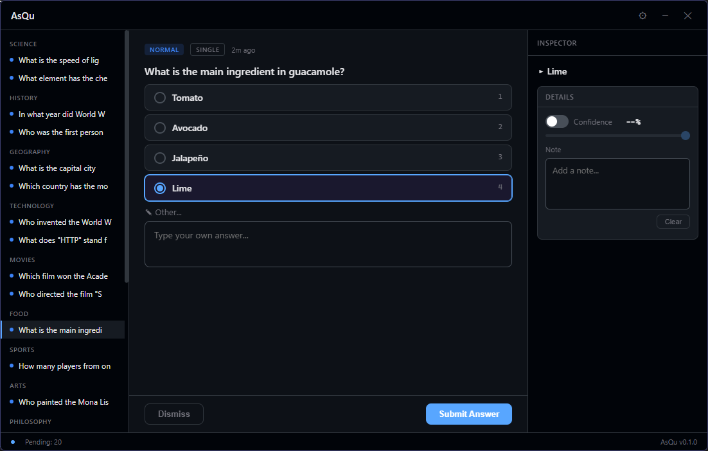

<p align="right">
  <a href="README.md">🇺🇸 English</a>
</p>

<h1 align="center">AsQu</h1>

<p align="center">
  <a href="LICENSE"></a>
  
  
  
</p>

<p align="center">
  <b>AI 코딩 에이전트를 위한 비동기 질문 큐</b><br>
  질문이 데스크톱 앱에 쌓이고, 원하는 타이밍에 답변 — 에이전트가 멈추며 기다리는 일은 없습니다.
</p>

<p align="center">
  
</p>

## AsQu란?

AsQu는 [Claude Code](https://docs.anthropic.com/en/docs/claude-code) 등 MCP 호환 에이전트를 위한 비동기 질문 큐입니다. 에이전트가 질문 하나에 막혀 멈추는 대신, 질문들이 데스크톱 UI에 쌓이고 사용자가 편할 때 답변할 수 있습니다.

## 설치

### 사전 요구사항

- [Rust](https://rustup.rs/) 툴체인 (2024 에디션)
- [Tauri 2](https://v2.tauri.app/start/prerequisites/) 플랫폼 의존성

### 설치

```bash
# 1. 바이너리 설치
cargo install --git https://github.com/inonego/AsQu.git --bin asqu

# 2. 마켓플레이스 등록
claude plugin marketplace add inonego/AsQu

# 3. 플러그인 설치
claude plugin install asqu
```

## MCP 설정

프로젝트 `.mcp.json` 또는 글로벌 `~/.claude.json`에 추가:

```json
{
  "mcpServers": {
    "asqu": {
      "command": "asqu"
    }
  }
}
```

> `cargo install`로 설치하지 않은 경우, `"asqu"` 대신 바이너리의 전체 경로를 지정하세요.

MCP 서버가 시작되면 데스크톱 UI가 자동으로 실행됩니다.

## MCP 도구

| 도구 | 설명 |
|---|---|
| `ask` | 질문 제출 (자유 입력, 단일/다중 선택, instant, category/priority 지원) |
| `get_answers` | 답변 상태 비차단 조회 |
| `wait_for_answers` | 답변 도착까지 대기 (timeout, require_all 지원) |
| `list_questions` | 상태별 질문 목록 조회 |
| `dismiss_questions` | 대기 중인 질문 취소 |
| `open_ui` | 데스크톱 창 표시 |

## 라이선스

[MIT](LICENSE)
